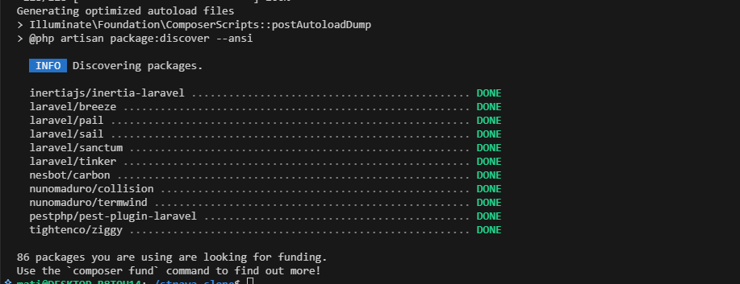
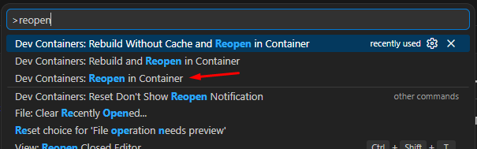
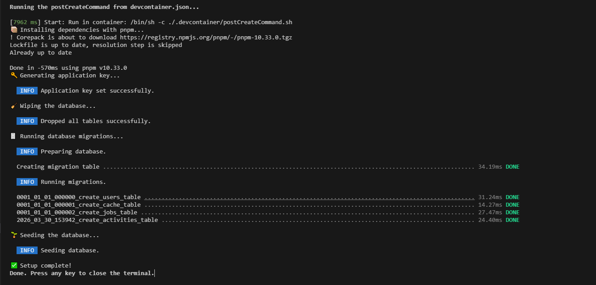
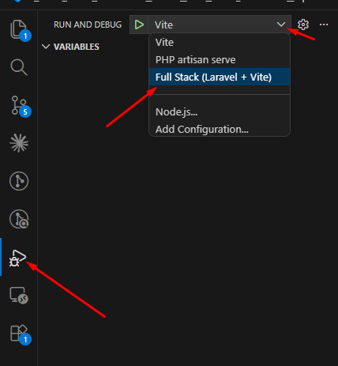

# Laravel + Vue 3 + Inertia — Dev Setup

Stack: **Laravel 11**, **Vue 3**, **Inertia.js**, **Tailwind CSS v4**, **TypeScript**, running inside a **Dev Container** (Docker + Laravel Sail).

---

## Requirements

- [Docker Desktop](https://www.docker.com/products/docker-desktop/)
- [VS Code](https://code.visualstudio.com/) with the [Dev Containers](https://marketplace.visualstudio.com/items?itemName=ms-vscode-remote.remote-containers) extension

---

## 1. Clone the repository

```bash
git clone https://github.com/Console-dungeon/strava-clone.git
cd  strava-clone
```

---

## 2. Run `make init`

This step must be done **before** opening the project in a container. It:

- copies `.env.example` → `.env`
- installs Composer dependencies via a temporary Docker container (no local PHP required)

```bash
make init
```

> Works on Linux, macOS, and Windows (Git Bash / MSYS2).

---
### After running `make init`, you should see a new `.env` file and a `vendor` folder in the project directory:



## 3. Open in Dev Container

Open the project folder in VS Code, then when prompted click **"Reopen in Container"** — or use the command palette:

```
Dev Containers: Reopen in Container
```



VS Code will build the Docker environment and automatically run the post-create script, which:

- installs frontend dependencies with `pnpm install`
- generates the application key (`php artisan key:generate`)
- wipes and re-runs all migrations
- seeds the database with demo data

---

### Post-create script output should look like this:



## 4. Start the application

The application is started through the debugger, which also opens the browser automatically. Use the bult-in vscode "Run and Debug".



> If you'll run next time press `F5` or use the "Run and Debug" panel, it will remember the last used configuration and start the app without asking. 
---

<!-- INSERT SCREENSHOT: running app in browser / debugger active -->

## Useful commands (inside the container)

| Command             | Description                            |
| ------------------- | -------------------------------------- |
| `pnpm dev`          | Start Vite in watch mode               |
| `pnpm build`        | Production build (with type checking)  |
| `pnpm lint`         | Lint & auto-fix TypeScript / Vue files |
| `php artisan serve` | Start the Laravel development server   |
